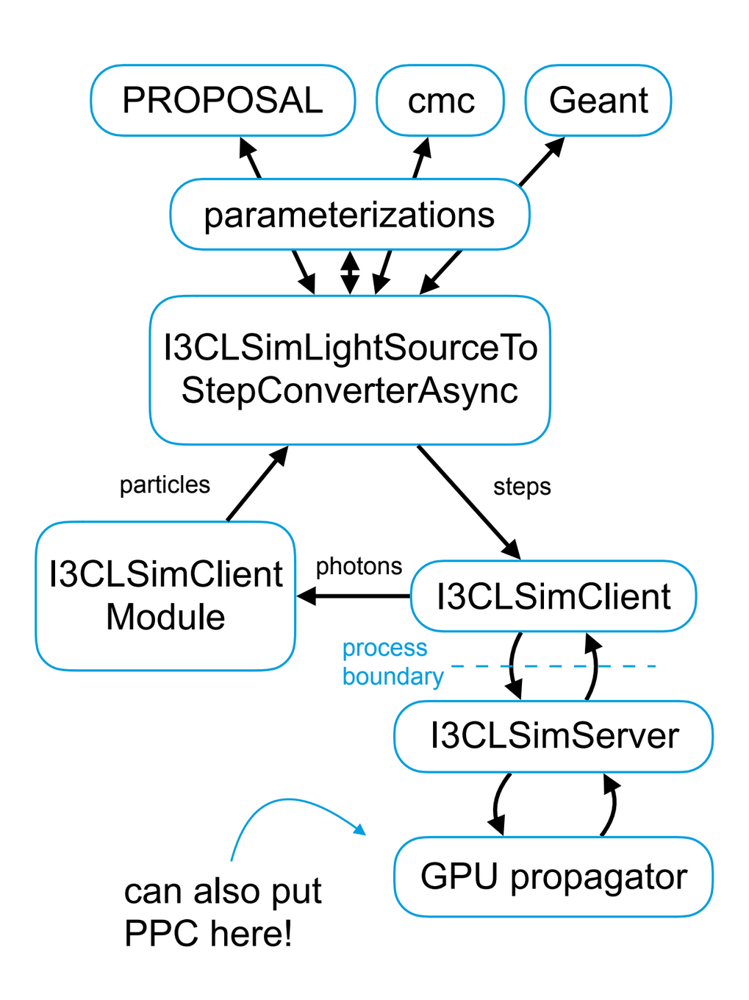

..
.. Copyright (c) 2019
.. Andres Medina <amedina@icecube.wisc.edu>
.. Jessie Micallef <jmicallef@icecube.wisc.edu>
..
.. Permission to use, copy, modify, and/ordistribute this software for any
.. purpose with or without fee is hereby granted, provided that the above
.. copyright notice and this permission notice appear in all copies.
..
.. THE SOFTWARE IS PROVIDED "AS IS" AND THE AUTHOR DISCLAIMS ALL WARRANTIES
.. WITH REGARD TO THIS SOFTWARE INCLUDING ALL IMPLIED WARRANTIES OF
.. MERCHANTABILIITY AND FITNESS. IN NO EVENT SHALL THE AUTHOR BE LIABLE FOR ANY
.. SPECIAL, DIRECT, INDIRECT, OR CONSEQUENTIAL DAMAGES OR ANY DAMAGES
.. WHATSOEVER RESULTING FROM LOSS OF USE, DATA OR PROFITS, WHETHER IN AN ACTION
.. OF CONTRACT, NEGLIGENCE OR OTHER TORTIOUS ACTION, ARISING OUT OF OR IN
.. CONNECTION WITH THE USE OR PERFORMANCE OF THIS SOFTWARE.
..
..
.. @file overview.rst
.. @version $LastChangedRevision$
.. @date $Date$
.. @author Andres Medina and Jessie Micallef
      

Overview
========

CLSim is a simulation software package that utilizes OpenCL to propagate photons from
I3Particles or flashers.  These are done in a series of steps that are managed by three
main classes,  I3CLSimLightSourceToStepConverterAsync, I3CLSimClientModule, and I3CLSimClient.
Each of these work together to take particles, produce light-emitting ``steps`` and produces
photons that are converted into hits or photoelectrons on DOMs.

CLSim main function is to parallelize the conversion of light sources to steps and also steps
to photons. The code even takes in multiple frames at once to run on and sorts them back into
their proper event ID after finishing.

Light Source to Steps
---------------------
The first step in *clsim* is to convert "light sources" into a series of light-emitting "steps".
Each of these steps has a constant speed of :math:`\beta = v/c`. For each of these steps a Cherenkov
angle is given to determine the direction of the photons emitted. These photons are then given a
random azimuth angle. Finally a distribution is sampled to determine the number of photons emitted
( usually 0-5 photons but can vary).  This section will outline the different classes that are
responsible for the conversion of light sources to steps.

There are different conversion methods available in *clsim*. By default, steps are created using a full
*Geant4* simulation, but alternative parameterizations can be used to speed up the process. Note that
*Geant4* tends to get very slow at higher energies (:math:`E>10 TeV`). The current version of *clsim* comes with
a parameterization that is compatbile to "ppc" (i.e. uses the same math as *ppc*). Parameterizations
can be used for only a subset of particles and energies.  There is a clsim option, called crossover,
that will switch between which converter is used (*Geant4* or *ppc* parameterizations) depending on
the energy.  Using crossover is a front end switch that will pick which converter can be used for
that event, so it will not be discussed here as the focus is on the converters themselves.

Below are paths to the conversion files and other light source pieces of the code. Under their paths
are brief descriptions of what the file contains.

Location of Light SourceToStep conversion files:                 
    * clsim/private/clsim/I3CLSimLightSourceToStepConverterFlasher.cxx 
    * clsim/private/clsim/I3CLSimLightSourceToStepConverterPPC.cxx     
    * private/geant4/I3CLSimLightSourcePropagatorGeant4.cxx            
    * clsim/private/clsim/I3CLSimLightSourceToStepConverterAsync.cxx    
    * clsim/private/clsim/I3CLSimLightSourceToStepConverter.cxx              
    * clsim/private/clsim/I3CLSimLightSourceToStepConverterUtils.cxx    

Other Light Source files:
    * clsim/private/clsim/I3CLSimLightSourceParameterization.cxx
    * clsim/private/clsim/I3CLSimLightSourcePropagatorFromI3PropagatorService.cxx

As mentioned above, *clsim* can adjust to flasher data. If flasher input is given, then
I3CLSimLightSourceToStepConverterFlasher is used. If it is specified to use the PPC
parameterization when *clsim* is called, then I3CLSimLightSourceToStepConverterPPC
coverter is used. The class I3CLSimLightSourcePropagatorGeant4 converts the particles to
steps using *Geant4*, which is the default converter that *clsim* uses.

I3CLSimLightSourceToStepConverterAsync sets up the converters. Specifically, it sets up
the threads and initializes parameterization. It contains functions like SetPropagators,
SetMediumProperties, SetWlenBias (wavelength bias), and SetMaxBunchSize. It also sets up
the barriers, which are put in to help act as checkpoints.

I3CLSimLightSourceToStepConverter.cxx has the set and get functions for LightSourceParameterzationSeries.
It also has GetConversionResult. 
    
Steps to Photons
----------------

A step which is defined by the I3CLSimStep is the necessary object that will produce the photons
that are then propagated. This is generated by the StepConverter classes above.

Once a set of steps is generated, they are uploaded to the compute device (i.e. CPU, GPU).
The GPU runs "kernels " in parallel that are responsible for creating photons from the steps,
propagating them through ice layers and checking for collisions with DOMs. All photons that
collided are saved with their full information (including direction, position of the DOM,
wavelength, number of scatters, propoerties at it's point of creation, ...). Those photons
are then sent back to the host, converted to I3FrameObjects (I3CompressedPhoton) and saved in the frame.
In order to keep the GPU busy, multiple frames (==events) are simulated in parallel. The clsim
module takes care of correctly re-assembling the events afterwards.

The output of the GPU simulation setup is thus a list of photons at the DOM surface. These photons
still need to be converted into hits, which is done using a dedicated module. This module finally
writes a I3MCPESeriesMap, compatible to all existing photon simulation output.

Photons to Photoelectrons
-------------------------
The I3CLSimModule is responsible for converting the photons into an I3MCPESeriesMap.
This process is taken care of by the I3CLSimPhotonToMCPEConverter which takes a single
ModuleKey/I3CompressedPhoton pair to an OMKey/I3MCPE pair (or nothing).

CLSim Diagram
--------------

