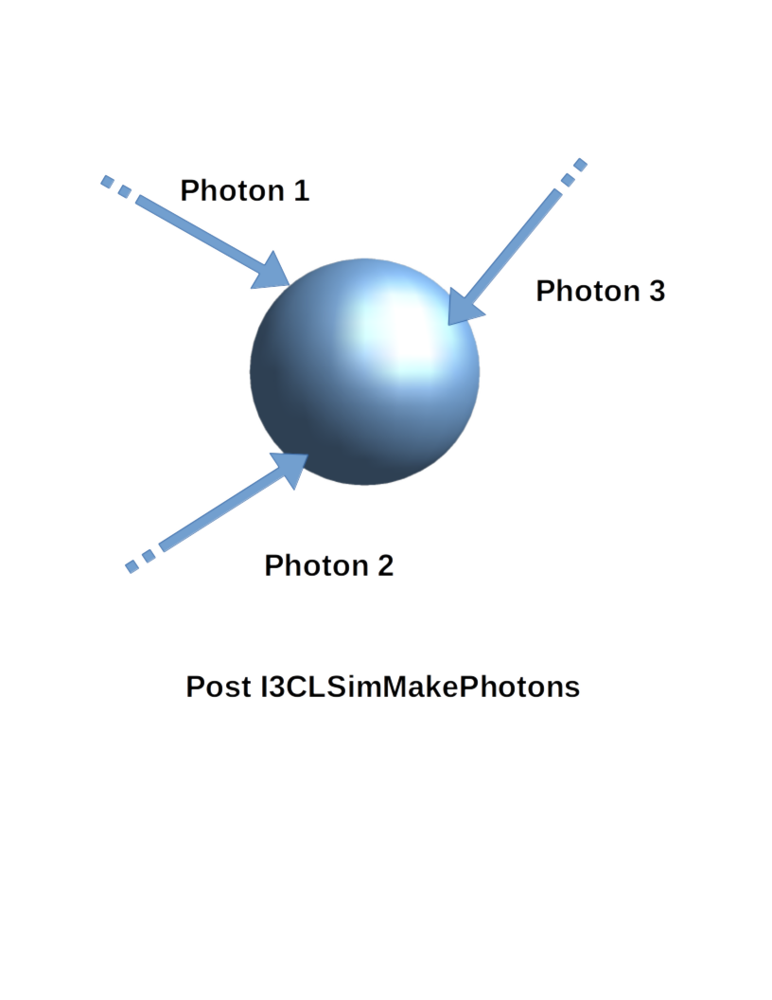
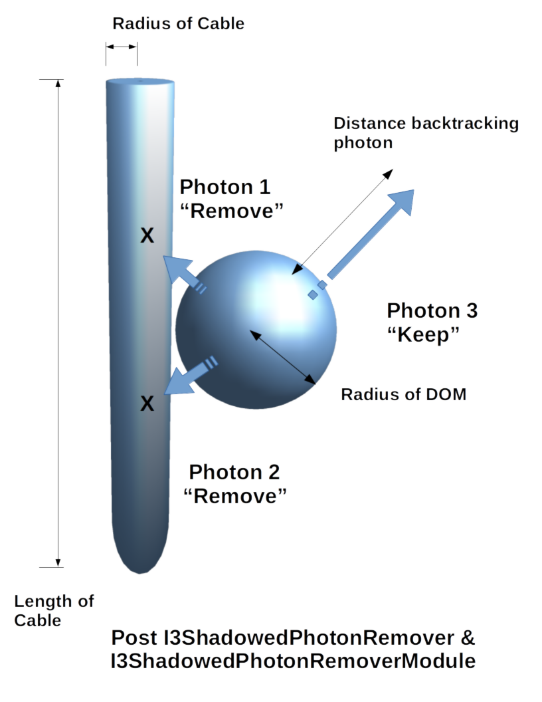

Usage
=====

This section currently only covers the standard usage of the module/service
chain for IceCube, using a fully parameterized model (i.e. without *Geant4*).

Basic usage
-----------

For a simple simulation run, you should process your I3MCTree using *MMC*.
Then, just use the supplied "tray segment" to add all relevant services
and modules to the I3Tray::

   tray.AddSegment(clsim.I3CLSimMakeHits, "makeCLSimHits")

This reads the 'I3MCTree' and 'MMCTrackList' objects from each frame
and adds hits named 'MCHitSeriesMap'. All photons are generated in a way
compatible to *ppc*.

By default, *clsim* uses only the GPU for photon propagation (i.e.
CPU devices are skipped during OpenCL device enumeration). This behavior can
be changed using the ``UseGPUs`` and ``UseCPUs`` boolean options. The following
example would only use the CPU for simulation and skip all GPU devices::

   tray.AddSegment(clsim.I3CLSimMakeHits, "makeCLSimHits",
                   UseGPUs=False, UseCPUs=True)

Generating Photons using Geant4
-------------------------------

By default, *clsim* does apply photon yield parameterizations compatible
to *ppc*. This can, however, be turned off to use a full *Geant4* simulation
run. In this case, full GPU simulation might not be necessary because the photon
generation will become the bottleneck. 

To use *Geant4*, just enable the ``UseGeant4`` switch::

   tray.AddSegment(clsim.I3CLSimMakeHits, "makeCLSimHits",
                   UseGeant4=True)

Even in this mode, *Geant4* will **not** be used for muons that have a length
assigned. These are assumed to have been generated by *MMC*. Both, neutrino-generator
and Corsika generate muons without lengths, so the module should generally
do the right thing. To make absolutely sure that no parameterizations are used,
also set the ``MMCTrackListName`` option to ``None``. This will apply *Geant4* to all
particles in the I3MCTree (which are ``InIce`` and not ``Dark``), even if they
already have a length assigned to them. (You should make sure that this is what you
really want, as MMC might already have added cascades to the muon track that would
be added a second time by Geant4.)

Low-Energy simulations
----------------------

In order to simulate low energies in a more correct way, you might want to
consider disabling the DOM oversizing optimization. It is set to an oversize
factor of 5 (in radius), which gives you a 25-fold increase in simulation
speed at the expense of accuracy in timing and for tracks very close to DOMs.

To disable DOM oversizing (which might be a good idea especially when using Geant4)
use the DOMOversizeFactor switch::

   tray.AddSegment(clsim.I3CLSimMakeHits, "makeCLSimHits",
                   DOMOversizeFactor=1., # disables oversizing (default is 5.)
                   UseGeant4=True)       # enable or disable Geant4 as needed

Ice Models
----------

By default, the 'SPICE-Mie' ice model is used. This can, however, easily be changed by
supplying either a *photonics*-compatible ice description file or a
*ppc*-compatible ice description directory using the 'IceModelLocation'
parameter::

   tray.AddSegment(clsim.I3CLSimMakeHits, "makeCLSimHits",
                   IceModelLocation=expandvars("$I3_BUILD/clsim/resources/ice/ppc_aha_0.80"))

Another example (using a *photonics* file) would be::

   tray.AddSegment(clsim.I3CLSimMakeHits, "makeCLSimHits",
                   IceModelLocation=expandvars("$I3_BUILD/clsim/resources/ice/photonics_wham/Ice_table.wham.i3coords.cos090.11jul2011.txt"))

Example Script
--------------

This is a short example script that reads an input ``.i3`` file,
applies *MMC* and *clsim* and writes the result to a second file.
It also uses Geant4 for photon generation and is configured to run
on the CPU only. In addition, adding a random number generator using
a python object (instead of a I3Service) is demonstrated.

.. highlight:: python

::

   from I3Tray import *
   from os.path import expandvars
   import os, sys

   from icecube import icetray, dataclasses, dataio, phys_services
   from icecube import clsim

   I3Seed  = 12345
   # a random number generator
   randomService = phys_services.I3SPRNGRandomService(
       seed = I3Seed,
       nstreams = 10000,
       streamnum = 1)
   tray = I3Tray()

   tray.AddModule("I3Reader","reader",
                  Filename="input.i3")

   tray.AddSegment(clsim.I3CLSimMakeHits, "makeCLSimHits",
       RandomService = randomService,
       UseGPUs=False,
       UseCPUs=True, 
       UseGeant4=True,
       IceModelLocation=expandvars("$I3_BUILD/clsim/resources/ice/spice_mie"))

   tray.AddModule("I3Writer","writer",
       Filename = "output.i3")

   tray.Execute()
   
Cable Shadow
------------

While the IceCube DOM has nearly uniform azimuthal acceptance, roughly 1/10th
of the photocathode is shadowed by the communications and power cable. The
clsim photon propagation kernel accounts for this by recording photon
intersections with DOMs only if the photon path does not intersect the cable
near the DOM. The cable is assumed to be a vertical, opqaue cylinder with 46 mm
diameter and infinite vertical extent, flush with the DOM sphere.

This treatment, however, is disabled by default. It can be enabled by setting
the CableOrientation parameter of I3CLSimMakePhotons (or a derived tray
segment) to the path to a file giving the azimuthal orientation of the cable at
each DOM. Examples include:

* ice-models/resources/models/cable_position/orientation.led7.txt: positions derived from an analysis of the intensity at neighboring strings when LED 7 was flashed (source-oriented). This assumes that the angle between LED 7 and the cable is always 90 degrees, and constrains the positions to within a few degrees.
* ice-models/resources/models/cable_position/orientation.shadow.txt: positions derived from an analysis of the received intensity compared to simulation as a function of the simulated cable position. This makes no assumptions on the rotation of the cable w.r.t. to the DOM mainboard, but only constrains the position to tens of degrees.

Either option reduces the average DOM acceptance by 10%, but in a
directionally-specific way. The UnshadowedFraction parameter that has been used
to account for the cable shadow/DOM efficiency in the past is _not_
automatically adjusted to compensate, so downstream analyzers will have to
handle this themselves.

