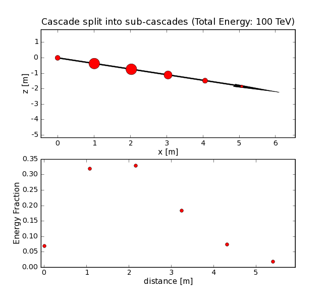

..
.. Copyright (c) 2020
.. Bernhard Voigt <bernhard.voigt@desy.de>
.. Sebastian Panknin <panknin@physik.hu-berlin.de>
.. Alex Olivas <aolivas@umd.edu>
.. Juan Carlos Diaz-Velez <juancarlos.diazvelez@icecube.wisc.edu>
.. Justin Lafranchi <jll1062@psu.edu>
.. Brian Clark <brianclark@icecube.wisc.edu>
..
.. Permission to use, copy, modify, and/ordistribute this software for any
.. purpose with or without fee is hereby granted, provided that the above
.. copyright notice and this permission notice appear in all copies.
..
.. THE SOFTWARE IS PROVIDED "AS IS" AND THE AUTHOR DISCLAIMS ALL WARRANTIES
.. WITH REGARD TO THIS SOFTWARE INCLUDING ALL IMPLIED WARRANTIES OF
.. MERCHANTABILIITY AND FITNESS. IN NO EVENT SHALL THE AUTHOR BE LIABLE FOR ANY
.. SPECIAL, DIRECT, INDIRECT, OR CONSEQUENTIAL DAMAGES OR ANY DAMAGES
.. WHATSOEVER RESULTING FROM LOSS OF USE, DATA OR PROFITS, WHETHER IN AN ACTION
.. OF CONTRACT, NEGLIGENCE OR OTHER TORTIOUS ACTION, ARISING OUT OF OR IN
.. CONNECTION WITH THE USE OR PERFORMANCE OF THIS SOFTWARE.
..
..
.. @file cmc_code.rst
.. @version $LastChangedRevision$
.. @date $Date$
.. @author Brian Clark

IceSim Module CascadeMonteCarlo (cmc)
=====================================

A cascade monte carlo module (cmc) has been developed to simulate the
longitudinal development of cascades. It searches the MCTree for cascade-like
particles and replaces all cascades above a certain energy
(``EnergyThresholdSplit``) by a list of sub-cascades representing the
longitudinal shower development. The replacements are electromagnetic showers.
Before a hadron shower is replaced, the energy scaling is applied.
The original MCTree is not modified, rather a new copy is put into the frame.

The distance between the sub-cascades is configurable (``SplitWidth``),
the total energy is the same as the original cascade and all sub-cascades
are pointing in the direction of the original cascade. The time of each
sub-cascade is adjusted so that it appears at a time when the particles
have traveled (at the speed of light) to the point of the sub-cascade.

For cascades with energies below configurable threshold
(``EnergyThresholdSimulation``) the parametrization of the
longitudinal development is used to calculated the fractional energy of
the sub-cascades. Above this value the full simulation is performed to obtain
the energy deposit profile individually for each shower. This is important
for energies in the LPM regime O(>10 PeV).

For hadronic cascades above ``EnergyThresholdMuons`` muons with energies above
the same limit are generated and sorted by energy. The first ``MaxMuons``
muons are taken into account the rest is dismissed.
The energy is reduced by the energy of the muons.

Parameters
----------

* ``EnergyThresholdSimulation``: Threshold energy to simulate the
  cascade development, rather than using a parametrization (Default: 1 PeV)
* ``EnergyThresholdSplit``: Threshold energy for splitting a cascade-like
  particle into a set of sub-cascades (Default: 1 TeV)
* ``InputMCTree``: Name of the MCTree/MCList in the frame to be used
  as input (Default: MCTree)
* ``OutputMCTree``: Name of the MCTree added to the frame with particles
  after splitting (Default: CMCTree)
* ``SplitWidth``: Distance between individual sub-cascdes in units
  of radiation length (~36cm) (Default: 3)
* ``EnergyThresholdMuons``: Threshold energy for generating muons
  for a cascade (Default: 1 GeV)
* ``MaxMuons``: Maximal number of muons to generate (ordered by energy) (Default: 10)

  The upper plot shows a series of sub-cascades as a replacement of an 100TeV
  cascade incidenting from -70 degrees zenith angle and starting at x,y,z=0.
  The size of the points correspond to the fractional energy.
  The lower plot shows the fractional energy versus the distance
  to the vertex of the cascade.

Example
-------

The example shows the interplay of I3SimpleGenerator, the I3CascadeMCModule
and the I3HitConstructorModule. The hit-constructor is configured to use
the MCTree produced by the cmc module. The cmc module itself, splits
cascade-like particles found in the MCList. It uses the simulation for
particles above 500 TeV and produces sub-cascades every 6 radiation lengths.
The original MCTree was initially put into the frame by the
simple-generator module.

::

	 # create particles with energies between 100 TeV and 10 EeV
	 tray.AddModule("I3SimpleGenerator","generator") (
	               ("NMuEvent", 0),
	               ("NEEvent", 1),
	               ("EnergyMin", 100.*I3Units.TeV),
	               ("EnergyMax", 10.*I3Units.EeV))
	 # cascade monte carlo module
	 tray.AddModule('I3CascadeMCModule', 'cmc') (
	               ('InputMCTree', 'MCList'),
	               ('OutputMCTree', 'CMCTree'),
	               ('EnergyThresholdSimulation', 500 * I3Units.TeV),
	               ('SplitWidth', 6))  # distance between sub-cascades is 6 * X0 ~ 6 * 36cm
	  tray.AddModule('I3HitConstructorModule','hit-constructor')(
	                ('MCTreeName','CMCTree'))  # use MCTree produced by cmc module

If one wants to apply the cascade-splitting to cascades produced by muons
(usually put into the MCTree by mmc), this module should be invoked
after the muon-propagation.

Code Organization
-----------------

* ``I3CascadeMCModule``: An IceTray module, that searches the frame for the MCTree,
  walks through the tree and replaces the cascade-like particles and generates
  muons for the hadronic cascades. One method calculationg physics is defined,
  it rescales the energy of hadronic cascades. The splitting is done
  using the I3CascadeSplit class.

* ``I3CascadeSplit``: A class that holds two specialized I3CascadeDevelopment
  instances, one using the parametrization to calculate the energy loss profile,
  the other using a full simulation to calculate the energy loss profile.
  Only one user method is defined, SplitCascade takes a cascade-like particle
  and returns a vector of I3Particles representing the longitudinal development
  of the original cascade.

* ``I3CascadeSplit``: Only one user method is defined, GenerateMuons takes a
  cascade-like particle and returns a vector of I3Particles representing
  the generated muons and reduces as a side effect the energy of the original cascade.

* ``I3CascadeDevelopment``: An abstract class, defining the interface to
  obtain the energy loss profile and length of a shower.
  Specialized classes implementing the interface will compute the
  energy loss profile and store the result in a vector of doubles
  which is a member of this abstract class.

* ``I3CascadeParametrization``: Calculates the energy loss profile
  according to the parametrization described above.

* ``I3CascadeSimulation``: Implements the simulation described above to
  compute the energy loss profile of a very energetic shower.

* ``I3CascadeSimulationCrossSection``: Implementation of static
  functions to calculate the cross section parametrizations.

* ``I3MetropolisHastings``: A metropolis hasting sampler used to
  sample from the differential cross sections.

Tests
-----

* ``IceTrayTest``: uses the simple-generator to simulates NuE events of 100 TeV,
  calls the I3CascadeMCModule to split the cascade from this event and invokes
  the I3CascadeMCModuleTests module to check the content of the new MCTree
  produced by the I3CascadeMCModule. Tests the following:

  #. whether the original and new tree are in the frame
  #. whether the sub-cascade list is located at the same depth in the tree
  #. whether the first particle in the sub-cascade has childs (actually a
     test whether sub-cascades where added to the tree)

* ``I3CascadeSplitTests``: creaetes a I3Particle of 100 TeV and 100 PeV and a
  I3CascadeSplit instance to split it into a list of sub-cascades. For the
  low energy particle the parametrization is used for splitting,
  for the high energy particle a full simulation is performed to
  obtain the energy loss profile. Tests the following:

  #. whether the splitting yields a list of sub-cascades
  #. whether the location of the first sub-cascade is the same as the original cascade
  #. whether the direction of all sub-cascades is the same as the original cascade
  #. whether the sum of sub-cascade energies is the same as the energy of the original cascade

* ``I3CascadeMuonSplitTests``: creaetes a I3Particle of 100 TeV and a
  I3CascadeMuonSplit instance to generate a list of muons. Tests the following:

  #. whether the splitting yields a list of muons
  #. whether the location of the muons is the same as the original cascade
  #. whether the direction of all muons is the same as the original cascade
  #. whether the sum of muon energies plus the new cascade energy is the same
     as the energy of the original cascade
