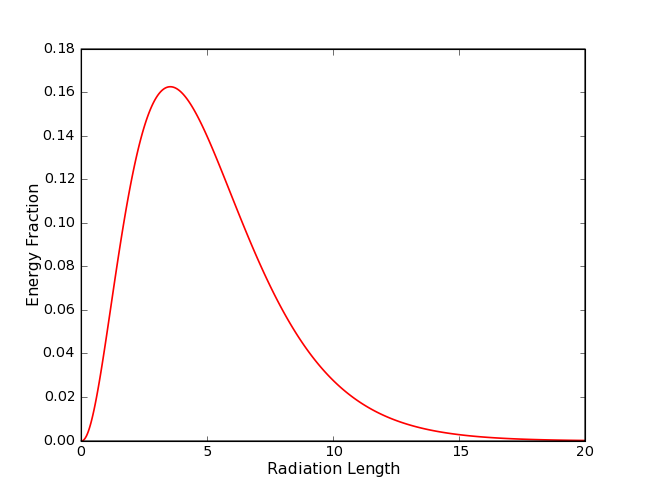
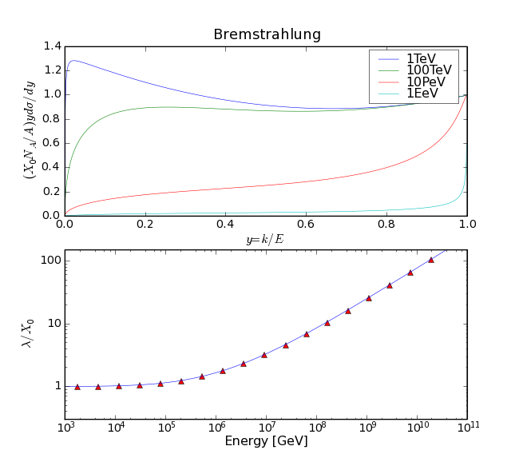
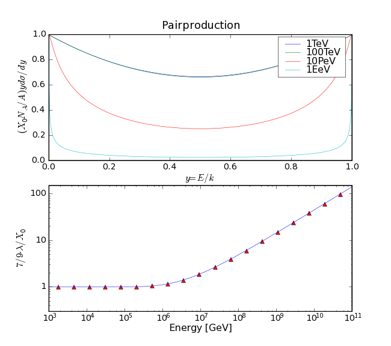
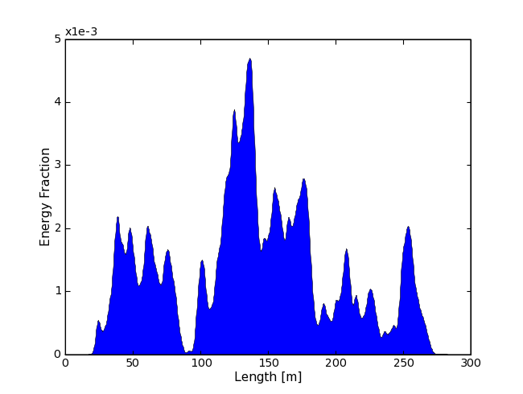
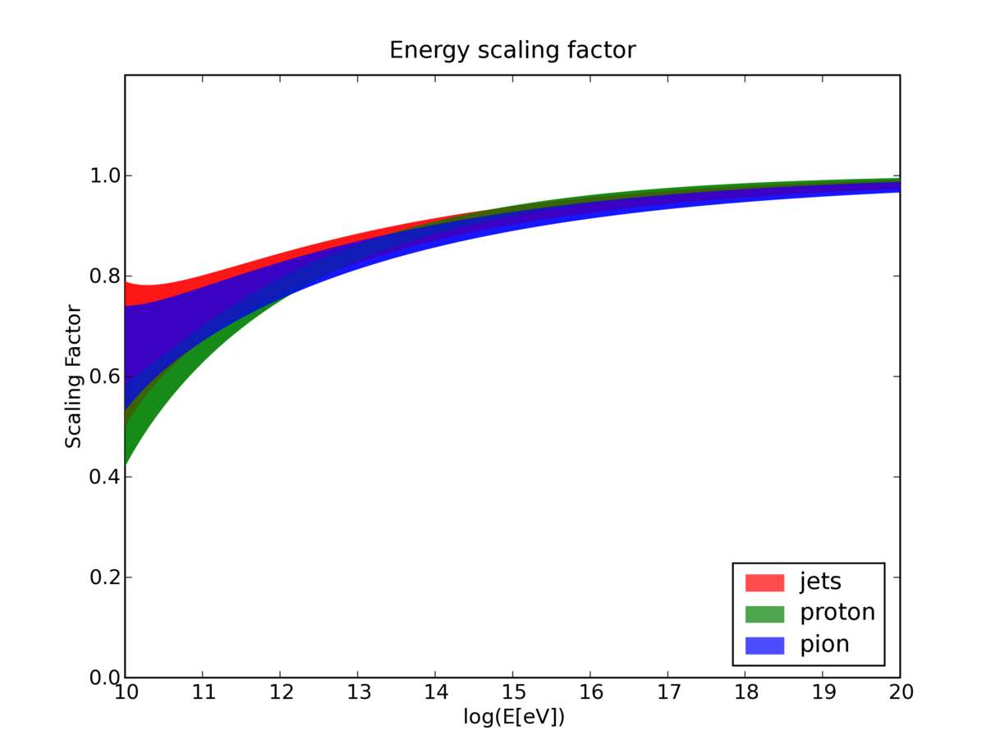
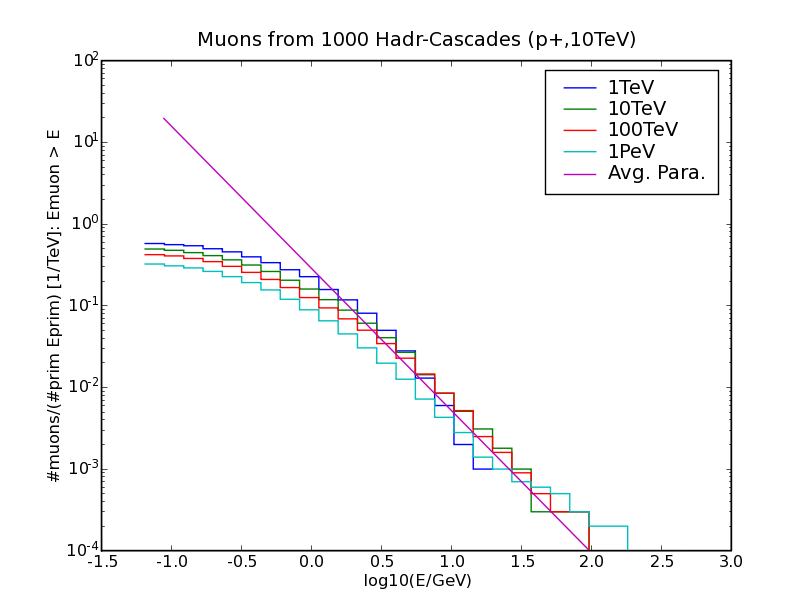

..
.. Copyright (c) 2020
.. Bernhard Voigt <bernhard.voigt@desy.de>
.. Sebastian Panknin <panknin@physik.hu-berlin.de>
.. Alex Olivas <aolivas@umd.edu>
.. Juan Carlos Diaz-Velez <juancarlos.diazvelez@icecube.wisc.edu>
.. Justin Lafranchi <jll1062@psu.edu>
.. Brian Clark <brianclark@icecube.wisc.edu>
..
.. Permission to use, copy, modify, and/ordistribute this software for any
.. purpose with or without fee is hereby granted, provided that the above
.. copyright notice and this permission notice appear in all copies.
..
.. THE SOFTWARE IS PROVIDED "AS IS" AND THE AUTHOR DISCLAIMS ALL WARRANTIES
.. WITH REGARD TO THIS SOFTWARE INCLUDING ALL IMPLIED WARRANTIES OF
.. MERCHANTABILIITY AND FITNESS. IN NO EVENT SHALL THE AUTHOR BE LIABLE FOR ANY
.. SPECIAL, DIRECT, INDIRECT, OR CONSEQUENTIAL DAMAGES OR ANY DAMAGES
.. WHATSOEVER RESULTING FROM LOSS OF USE, DATA OR PROFITS, WHETHER IN AN ACTION
.. OF CONTRACT, NEGLIGENCE OR OTHER TORTIOUS ACTION, ARISING OUT OF OR IN
.. CONNECTION WITH THE USE OR PERFORMANCE OF THIS SOFTWARE.
..
..
.. @file physics_overview.rst
.. @version $LastChangedRevision$
.. @date $Date$
.. @author Brian Clark

Physics Overview
================

Introduction
------------

The light yield and hit time information for cascade-like events is based on
the Photonics tables for electro-magnetic showers. The tables contain
normalized information (time and amplitude) for a point like light source
with a fixed angular emittance pattern.

Logitudinal Development
-----------------------

Without any special treatment, cascade-like particles do not have any spatial
expansion in the simulation. In order to take into account that the light
emittance volume is a couple of meters in length for cascades above TeV energy
one can split a single cascade into parts. Each of these sub-cascades gets a
fractional energy according to the energy loss profile and is displaced in
space and time according to the direction of the original cascade.

Using a detector simulation like GEANT one can obtain a parametrization for
the energy loss profile (`see Ch. Wiebusch thesis chapter 5 <https://web.physik.rwth-aachen.de/~wiebusch/Publications/Various/phd.pdf>`_),
including all energy loss processes. At high energies, well above the critical
energy Bremsstrahlung and Pair production processes govern the longitudinal
development of electro-magnetic showers. At energies above 1PeV the cross
sections of these processes are suppressed and high energy secondary particles
can travel long distances in the medium before their energy is deposited.
This leads showers with an extension of up to hundreds of meters and the
energy loss profile can't be described by a parametrization due to fluctuations
caused by the high energy secondaries.

Parameterization
^^^^^^^^^^^^^^^^

The energy loss profile of electromagnetic showers with energies below
1PeV is described by a gamma function (PDG Booklet Section EM-cascades):

.. math::

   \frac{dE}{dt} = E_{0}b \frac{(bt)^{a-1}e^{bt}}{\Gamma(a)}

Here :math:`t` is the depth of the cascade in units of radiation length.
The light yield due to Cherenkov-Radiation follows the same distribution.
Christopher Wiebusch determined the parameters :math:`a` and :math:`b`
using GEANT for the Cherenkov light yield.

  Energy loss profile of an electromagnetic shower.
  The plot shows the fractional energy versus the depth of the
  shower in units of radiation length. (The plot shows the fractional
  energy loss versus the shower depth in units of radiation length.
  The parametrization is taken from Christopher Wiebusch's thesis.)

Simulation
^^^^^^^^^^

For cascades with an energy above 1PeV a simulation of the shower is performed
(inspired by work in `astro-ph/0511617 <https://arxiv.org/abs/astro-ph/0511617>`_).
The simulation takes into account Bremsstrahlung and pair production
interactions and works only in one dimension. The suppression of the
Bremsstrahlung and pair production cross sections is included and the
formulas used are taken from Spencer Klein's review (`Suppression of Bremsstrahlung and pair production due to environmental factors <https://arxiv.org/abs/hep-ph/9802442>`_).
As shown in the plots, the differential cross sections for both interactions
are suppressed and starting at ~1PeV the mean free path rises significantly.

  Differential Bremsstrahlung cross section and radiation length in units of
  the normal radiation length :math:`X_{0}`.
  (Differential Bremsstrahlung Cross Section for various energies.
  The lower plot shows the integrated cross section, weighted with the
  energy of the emitted photon in units of the low energy
  radiation length :math:`X_{0}`)

  Differential Pair Production cross section and mean free path in units of
  the normal radiation length. (The differential Pair Production
  cross section for various energies. The lower plot shows the integrated
  cross section multiplied by 7/9 in units of the radiation
  length :math:`X_{0}` at lower energies.)

In the simulation, the particles are tracked down to a threshold energy,
which can be of the order of 1TeV. When a particle falls below this limit,
the energy loss profile is calculated according to the parametrization given
above and the individual energy loss profiles are added up to obtain the total
energy loss profile of full shower. The total energy loss profile is a
histogram binned in radiation length.

The following is the program flow the simulation:

1. Determine interaction point:
  - calculate mean free path/radiation length for particle with
    given energy (integrate differential cross section)
  - draw number according to exp(-x/lamdba) distribution, where
    lambda is the mean free path/radiation length

2. Interaction
  - Create Bremsstrahlung photon/electron-positron pair
  - Sample from differential cross section to get fractional energy of secondaries

3. Deposit or Track particle
  - if energy of primary/secondary particles is larger than
    simulation threshold go on with 1. for each particle
  - else deposit particle: calculate energy loss profile for particle
    and add it to the total energy loss profile

Here is some pseudo code::

	particles = [electron]
	while particle = particles.pop():
	   dx = sampleFreePath(particle.energy)
	   y = sampleCrossSection(particle.energy)
	   if particle == ELECTRON:
	     photon = Photon(particle.x + dx, particle.energy * y)
	   if particle == PHOTON:
	     electron1 = Electron(particle.x + dx, particle.energy * y)
	     electron2 = Electron(particle.x + dx, particle.energy - electron1.energy)

	   if (photon|electron1|electron2).energy > threshold:
	      particles.pushback(photon|electron1...)
	   else:
	      energyLossProfile[x+dx] += getEnergyLossProfile(photon|electron1...)

Calculation of differential cross sections and total cross sections
"""""""""""""""""""""""""""""""""""""""""""""""""""""""""""""""""""

As mentioned above, formulas for the differential cross sections are take from
Spencer Klein's review. The total cross section is calculated by integrating
the differential cross section. For the Bremsstrahlung cross section one has
to avoid the singularity at small x (fractional photon energy), therefore a
cut off is introduced. The cut off should be well above the critical energy
and still low enough to have Bremsstrahlung radiation every few centimeters.
By default it is 1 GeV. The cross sections are integrated for different
energies in the range needed for the simulation. The resulting total cross
sections are interpolated using B-Splines. This is done in the initialization
phase of the simulation. Interpolation and integration routines are taken
from the `GNU Scientific Library <https://www.gnu.org/software/gsl/>`_.

Drawing random numbers from Differential cross sections
"""""""""""""""""""""""""""""""""""""""""""""""""""""""

The fractional energy of the secondary particles is drawn from the differential
cross section using a `Metropolis-Hastings Algorithm <https://en.wikipedia.org/wiki/Metropolis–Hastings_algorithm>`_.
As a proposal density function the `Beta Distribution <https://en.wikipedia.org/wiki/Beta_distribution>`_
is used, which matches both cross sections pretty well when the right
parameters are used. Since the cross sections vary with energy a low and
high energy proposal distribution is provided. Therewith, random samples
are generated with a high efficiency and the total performance of the
simulation is very good.

Performance
"""""""""""

Depending on the threshold energy, a single shower with energies in the PeV
regime can be simulated in a few milliseconds (Threshold O(1TeV)).
A 10EeV showers is simulated within less than 3 minutes when the threshold
is set to 50 TeV.

Energy Corrections for Hadron Showers
-------------------------------------
It appears that the light yield of a hadron shower is equal to the light yield
of electromagnetic showers when it is scaled by a factor which is energy dependent.
With increasing energy the hadron shower becomes more and more electromagnetic
and thus the scaling factor becomes nearly 1. Since hadron showers fluctate,
the energy scaling is randomized (Gauss-Distribution) around the mean value.
The parametrization shown on the plot is taken from "On the Cherenkov light
emission of hadronic and electromagnetic cascades"
`(Internal Report by Marek Kowalski) <https://internal-apps.icecube.wisc.edu/reports/amanda/data/20020803-track.pdf>`_
and shows a one-sigma error band of the scaling factor for different hadron
shower events. Since the simulation only knows one type of hadron shower,
the proton parameters are used.

  Energy loss profile of a 10EeV electromagnetic cascade simulated with cmc.
  (Energy loss profile of an electro-magnectic cascade with an energy of 10EeV.
  The energy loss profile was obtained using the cmc IceSim module.)

  Parametrization of the scaling factor for hadron showers. (Parametrization of
  the energy scaling of hadronic shower types. The scaling factor is applied to
  the energy of a shower in order to match it to an electromagnetic shower with
  the same light yield.)

Muon Production in Hadron Showers
---------------------------------

For hadronic cascades muons will be produced. This was taken into account by
simulationg such cascades with Corsika and parameterize the produced muons
(`CMC with muons <http://icecube.physik.hu-berlin.de/~panknin/cmc>`_).
For each cascade the number of muons is a Poisson random number with mean
value taken from the parameterization. Then for each muon an energy
was generated. As a first approximation the muons will have the same
origin and the same direction as the original cascade.

  Parametrization of the muon generation of a hadronic cascade.
  (Integral plot for muons created from a shower: The simulation was done
  with Corsika in salt water (modified version by Terry Sloan) for different
  primary energies (colors). Protons were these primaries. The pink line is
  an averaged fit, applied on the differential form and integrated.)
