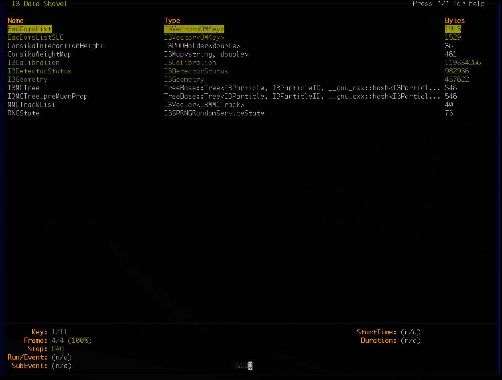

Corsika
=======

Corsika5ComponentGenerator
^^^^^^^^^^^^^^^^^^^^^^^^^^

.. highlight:: python

:class:`Corsika5ComponentGenerator` class lives in `$I3_SRC/simprod-scripts/python/modules/corsika.py`
and is part of simulation meta-project. This class needs other classes and functions part of `simprod-scripts` project,
like :class:`CorsikaGenerator` which depends of one of the main classes in `simprod-scripts`, :class:`ipmodules`. 

Below we show how to run it, and some details about what it does::

     from icecube.simprod.modules import Corsika5ComponentGenerator

     if __name__ == '__main__':
        stats = {}
        cors = Corsika5ComponentGenerator()
        cors.ExecuteOpts(stats)

You do not need to include anything else to get the output created by :class:`Corsika5ComponentGenerator`. In addition to source your 
`env-shell.sh`, you also will need to `eval /cvmfs/...`, since this uses some environment variables defined in /cvmfs

The outputs that you will see in your working directory are:

* Many log files starting with the word CORSIKA
* A corsika.isok file
* A DAT.gz file
* A dcors directory
* An user_icesoft directory

The above outputs are related to native Corsika production. 
The output directory with the i3 file that you would like to see is:

* outputCors5Comp
  
If you want to change the parameter-options in :class:`Corsika5ComponentGenerator`, you should go to your 
working copy `$I3_SRC/simprod-scripts/python/modules/corsika.py` to change things. For examles, this is configurated 
to generate 10 events (nshowers) through `self.AddParameter('nshowers','Number of generated CR showers',10)`,
then if you want more, just change the value of `nshowers`. 

.. note:: The number of events that you set will not be the number of `Q` frames that you will see in the output `outputCors5Comp/corsika.i3`, since no all the generated showers would reach the detector.  

A Q frame that you would see in the main output `outputCors5Comp/corsika.i3` looks like this:

   
The above information is some basic tips to run :class:`Corsika5ComponentGenerator`, below you would find more details.

Additional Information:
-----------------------

Five components means, that you are generating the following elements:

* Protons 
* Helium 
* Nitrogen (representing the CNO group) 
* Aluminum (representing the MgAlSi group) 
* Iron 

The spectral indices for H,He,N,Al,Fe is set through `AddParameter('pgam','5-component spectral indices H,He,N,Al,Fe',[2.65,2.60,2.60,2.60,2.60])`
in `$I3_SRC/simprod-scripts/python/modules/corsika.py`

You would find more information about this in:

`dCorsika5ComponentWiki <https://wiki.icecube.wisc.edu/index.php/5-Component_dCORSIKA>`_

`Livetime5ComponentCorsika <https://wiki.icecube.wisc.edu/index.php/Livetime_of_5-component_CORSIKA_files>`_  

